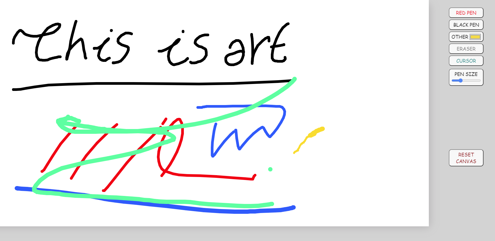
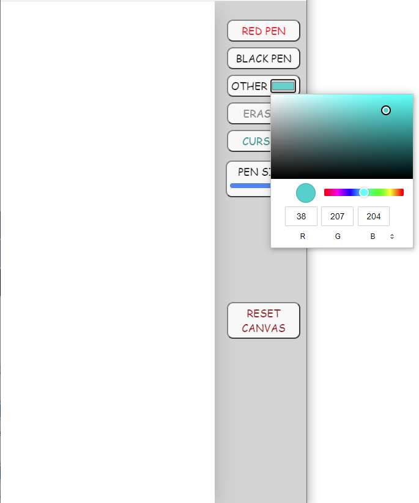

# [Quick_Paint](https://quickpaint.netlify.app/)

Quick Paint is a simple paint app, created mostly for educational purposes. The main idea was to create a nice simple paint app using (mostly) javascript.

 

## Download and Demo

Of course you can download the files from here: https://github.com/NasosG/simple-js-paint. 
 
You can see a demo of the app here: https://quickpaint.netlify.app/

## Requirements

A browser :-)

## Screenshots

### Just painted something :>

### App is funtional and responsive on smaller screens too

## Copyright and License

Copyright ©  2020. The project is available as open source under the terms of the MIT License.

- **[MIT license](http://opensource.org/licenses/mit-license.php)**
 
**-- THANKS FOR READING --**

